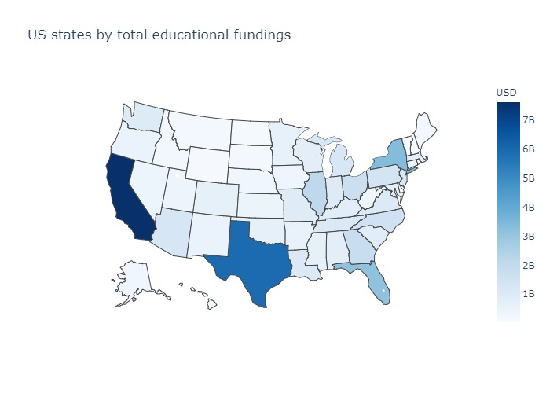
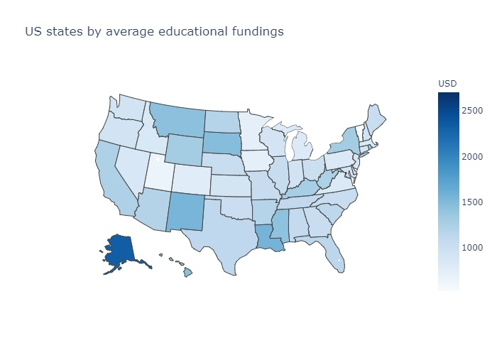
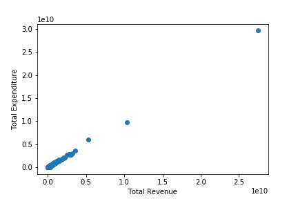
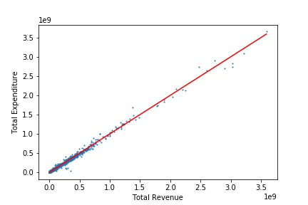
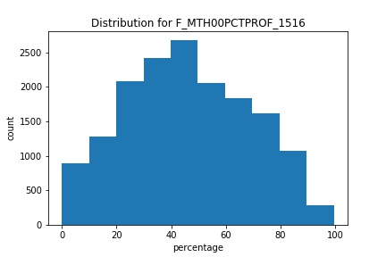

# ds5500hw3
# Q1
## Rank and visualize the states that take in the most federal funding (revenue).
| Rank | State | Federal Fundings |
|------|-------|------------------|
|1     |CA     |7,621,532,000     |
|2     |TX     |5,907,429,000     |
|3     |NY     |3,362,525,000     |
|4     |FL     |3,147,329,000     |
|5     |IL     |2,122,994,000     |


## Which states spend the most federal funding per student?
| Rank | State | Avg Federal Fundings |
|------|-------|------------------|
|1     |DC     |2,703             |
|2     |AK     |2,320             |
|3     |LA     |1,557             |
|4     |NM     |1,541             |
|5     |SD     |1,467             |


# Q2
## Visualize the relationship between school districts’ total revenue and expenditures.
  
This is hard to read due to the outliers. After the outliers are removed and adding the y=x line, we get  

## Which states have the most debt per student?
| Rank | State | Average Debt |
|------|-------|--------------|
|1     |ND     |1,618         |
|2     |DC     |1,295         |
|3     |AK     |969           |
|4     |NE     |766           |
|5     |MN     |693           |
# Q3
## Write and explain a function for processing a single column of “blurred” metrics into usable numeric values.
```
def process_col(col):
    def process_cell(cell):
        if cell == 'PS':
            return 0
        if cell == '' or cell == '.' or cell is np.nan:
            return 0
        m = re.match(r'(\d+)-(\d+)', cell)
        if m is not None:
            a, b = m.groups()
            a, b = int(a), int(b)
            return (a+b)/2
        m = re.match(r'LE(\d+)', cell)
        if m is not None:
            a, = m.groups()
            a = int(a)
            return (0+a)/2
        m = re.match(r'LT(\d+)', cell)
        if m is not None:
            a, = m.groups()
            a = int(a)
            return (0+a-1)/2
        m = re.match(r'GE(\d+)', cell)
        if m is not None:
            a, = m.groups()
            a = int(a)
            return (a+100)/2
        m = re.match(r'GT(\d+)', cell)
        if m is not None:
            a, = m.groups()
            a = int(a)
            return (100+a+1)/2
        return int(cell)
    return [process_cell(cell)
            for cell in col]
```
### Explanation
If the value is PS, it means the data is totally suppressed. This usually means that there are very few such students in this district, and hence should be fine to treat it as zero. For values in the form of "`x`-`y`" or "GE`x`", we simply treat it as the average within all of the possible numbers.

## Use it to process and then visualize the distribution of a performance metric of your choice.


# Q4
## You are tasked with cutting 15% of the U.S. federal budget currently being spent on funding school districts. How much money is this?
USD$ 8,340,410,870.7
## Choose which school districts will have their funding cut and how this will be done.
### Sample districts (Please see the jupyter notebook for all values)
| LEAID |   cut   |
|-------|--------:|
|0100002|        0|
|0100005|  966,017|
|0100006|        0|
|0100007|  833,778|
|0100008|1,528,273|
|0100009|        0|
|0100011|        0|
|0100012|  128,076|
|0100013|        0|
|0100015|        0|

# Q5
## Provide a statement for your supervisor justifying your decisions on which school districts will lose funding.
According to my investigation, the sum of the profits of the school that have a possible profits are higher than the total required cut of 15% of the federal budget. I suggest that we only cut the schools that already have positive budgets, since these school will have little impact on its financial stability. Schools that already of expenditure more than its revenue should not have federal fund cut if we can transfer the cut to other schools. For fairness, the cut of these school should be weighted against their profit for this year. This should be the best solution for the upcoming federal fund cut.
